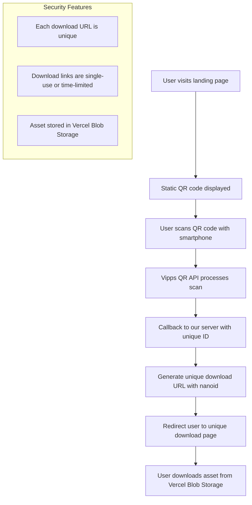

# KH Khalid Albair

A responsive landing page that displays a static QR code generated using the Vipps QR API. When scanned, the QR code redirects users to a unique download link, allowing secure access to digital assets with protection against link sharing.

## Flow Diagram

## Features

- Responsive landing page with Vipps QR code
- QR code generation using Vipps QR API
- Unique download links using nanoid
- Secure asset delivery via Vercel Blob Storage
- Download tracking and analytics

## Tech Stack

- Next.js for frontend and API routes
- Vercel for hosting and Blob Storage
- Vipps QR API for QR code generation
- nanoid for unique URL generation

## Getting Started

Instructions for setting up and running the project will go here.

## License

This project is licensed under the MIT License - see the LICENSE file for details.