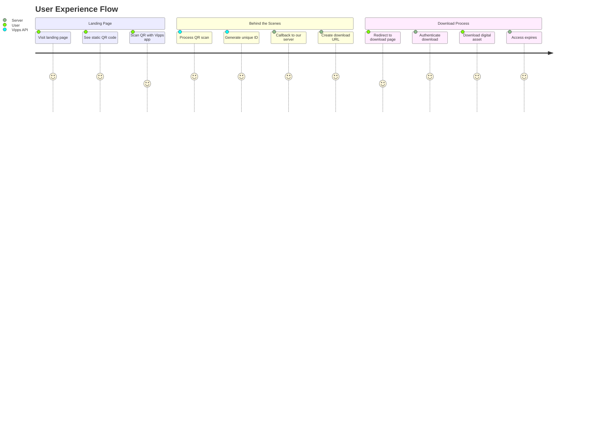
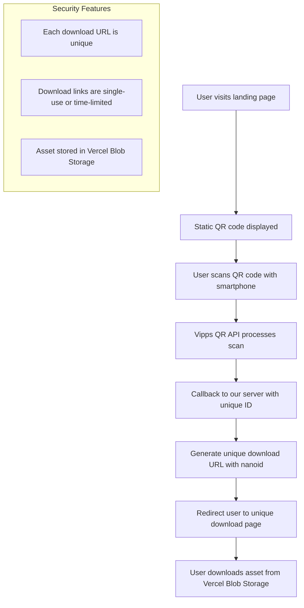

# KH Khalid Albaih

A responsive landing page that displays a static QR code generated using the Vipps QR API. When scanned, the QR code redirects users to a unique download link, allowing secure access to digital assets with protection against link sharing.

## User Journey Diagram



## Technical Flow Diagram



## Features

- Responsive landing page with Vipps QR code
- QR code generation using Vipps QR API
- Unique download links using nanoid
- Secure asset delivery via Vercel Blob Storage
- Download tracking and analytics

## Tech Stack

- Next.js for frontend and API routes
- Vercel for hosting and Blob Storage
- Vipps QR API for QR code generation
- nanoid for unique URL generation

## Getting Started

1. Clone the repository
   ```bash
   git clone <repository-url>
   cd kh-khalid-albaih
   ```

2. Install dependencies
   ```bash
   npm install
   ```

3. Create a `.env` file based on `.env.example`
   ```bash
   cp .env.example .env
   ```
   
4. Update the environment variables in `.env` with your Vipps API credentials and Vercel Blob token

5. Run the development server
   ```bash
   npm run dev
   ```

6. Open [http://localhost:3000](http://localhost:3000) in your browser to see the application

### Deployment

1. Push to the `dev` branch for development environments
   ```bash
   git checkout dev
   git push origin dev
   ```

2. For production deployment, merge changes to the `prod` branch
   ```bash
   git checkout prod
   git merge dev
   git push origin prod
   ```

## License

This project is licensed under the MIT License - see the LICENSE file for details.