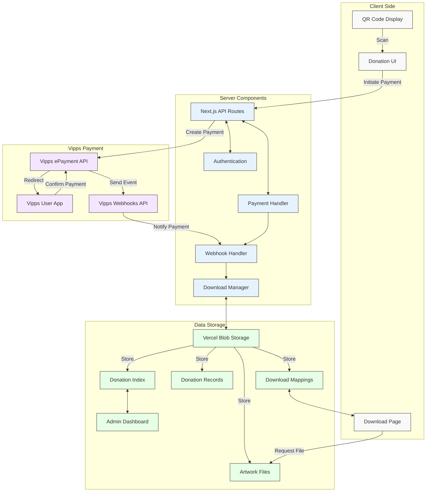

# KH Khalid Albaih

An interactive exhibition experience that enables visitors to support the artist and receive exclusive digital content. The system displays a static QR code generated using the Vipps QR API. When scanned, visitors are directed to a donation page where they can select an amount to contribute via Vipps mobile payment. After completing the payment, they receive access to a unique, single-use download link for exclusive digital art, secured through Vercel Blob storage.

## User Journey Diagram


## System Architecture Diagram



## Sequence Diagram


## Features

- Interactive exhibition experience with QR code display
- Static QR code generation using Vipps Merchant Redirect API
- Donation page with customizable contribution amounts
- Vipps mobile payment integration with webhook support
- Support for multiple webhook formats and payment statuses
- Automatic download mapping for immediate file access
- Secure payment processing with signature verification
- Unique, single-use download links with download tracking
- Secure digital asset delivery via Vercel Blob Storage
- Mobile-optimized user experience
- Admin dashboard for donation management

## Tech Stack

- Next.js for frontend, API routes, and server components
- Tailwind CSS for responsive design
- Vercel for hosting and Blob Storage
- Vipps QR API for QR code generation
- Vipps ePayment for donation processing
- nanoid for secure unique URL generation
- TypeScript for type safety

## Getting Started

1. Clone the repository
   ```bash
   git clone <repository-url>
   cd kh-khalid-albaih
   ```

2. Install dependencies
   ```bash
   npm install
   ```

3. Create a `.env` file based on `.env.example`
   ```bash
   cp .env.example .env
   ```
   
4. Update the environment variables in `.env` with your Vipps API credentials and Vercel Blob token

5. Run the development server
   ```bash
   npm run dev
   ```

6. Open [http://localhost:3000](http://localhost:3000) in your browser to see the application

## Vipps Webhooks Integration

This project uses Vipps Webhooks API for payment notifications. To register webhooks with Vipps:

1. Set up your environment variables:
   ```
   VIPPS_SUBSCRIPTION_KEY=your_subscription_key
   VIPPS_MERCHANT_SERIAL_NUMBER=your_msn
   VIPPS_ACCESS_TOKEN=Bearer your_access_token
   NEXT_PUBLIC_BASE_URL=https://your-domain.com
   ```

2. Register your webhook:
   ```bash
   node --experimental-modules scripts/register-vipps-webhook.js
   ```

3. Store the webhook secret provided in the response:
   ```
   VIPPS_WEBHOOK_SECRET=your_webhook_secret
   ```

4. To list your registered webhooks:
   ```bash
   node --experimental-modules scripts/register-vipps-webhook.js list
   ```

### Webhook Event Names

The Vipps Webhooks API uses these event types:

- `epayments.payment.created.v1`: Payment has been created (redirected to Vipps)
- `epayments.payment.authorized.v1`: Payment has been authorized (user approved)
- `epayments.payment.captured.v1`: Payment has been captured (funds transferred)
- `epayments.payment.cancelled.v1`: Payment has been cancelled
- `epayments.payment.expired.v1`: Payment has expired
- `epayments.payment.refunded.v1`: Payment has been refunded
- `epayments.payment.terminated.v1`: Payment has been terminated

Our system handles all of these events, with special handling for `created`, `authorized`, and `captured` statuses to provide a seamless user experience.

## Troubleshooting Downloads

If a payment is completed but the download doesn't work, there are a few things to check:

### Understanding Download Flows

The system supports two main download flows:

1. **Pre-Download Access (CREATED Status)**:
   - When a webhook with `CREATED` status arrives, we use the payment reference as the download ID
   - This enables users to access the download page immediately after initiating payment
   - Download is available even before payment is fully authorized

2. **Post-Payment Access (AUTHORIZED/CAPTURED Status)**:
   - For webhooks with `AUTHORIZED` or `CAPTURED` status, we generate a new download ID
   - These download links are separate from the CREATED status links

### Fixing Missing Downloads

If a download doesn't work (404 error), you can manually create the download mapping:

1. Identify the order reference from the payment (this is the unique ID generated during payment initiation)

2. Run the create-missing-download script:
   ```bash
   node scripts/create-missing-download.js <orderReference>
   ```

3. The script will output a download URL that you can share with the customer

This situation can occur if the Vipps webhook doesn't reach the server or fails to complete. The script creates both the download mapping and a basic donation record to ensure the download works.

### Deployment

1. Push to the `dev` branch for development environments
   ```bash
   git checkout dev
   git push origin dev
   ```

2. For production deployment, merge changes to the `prod` branch
   ```bash
   git checkout prod
   git merge dev
   git push origin prod
   ```

## License

This project is licensed under the MIT License - see the LICENSE file for details.